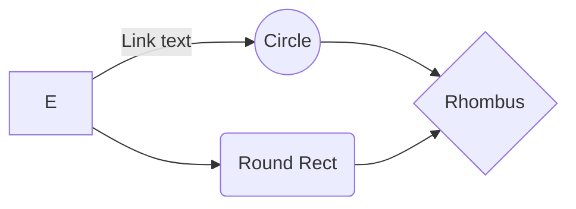

title: "Panel Ciudadanía Escolar"
---
# Reporte metodológico {-}

Para abordar esta pregunta se lleva a cabo un Estudio Panel de Ciudadanía Escolar entre 2019 y 2021, evaluando a una muestra representativa de padres, docentes y estudiantes de enseñanza media. 

**Diseño del Estudio Panel de Ciudadanía Escolar - PACES**
```{r echo=FALSE, fig.align='center'}
knitr::include_graphics("diseno1.png")
```

<!--stackedit_data:
eyJoaXN0b3J5IjpbLTYzNzE1NDMyLC0xMDM2Njc5MTc3LC0yMz
g2OTQxMDQsLTE2NDMyOTA5NjYsLTQyMzMyMDk5LC0xNjQzMjkw
OTY2LC04ODIzMTY1ODUsLTExOTk0NTIwOTldfQ==
-->