# Conocimiento y formación en la escuela
<div align="justify";>
El reporte de los resultados correspondientes a este módulo se organiza en dos secciones. En la primera sección se presentarán las respuestas de los estudiantes a un set de preguntas que evalúan su nivel de conocimiento cívico. En la segunda sección se expondrán las respuestas de los docentes, estudiantes y apoderados a una serie de preguntas sobre el nivel de importancia de distintos aspectos en la formación ciudadana de los estudiantes y sobre quiénes son los que más influyen en la enseñanza de estos aspectos. 
</div>
## Sección 1: Conocimiento cívico
<div align="justify";>
En esta sección se presentarán los resultados de una serie de preguntas que evalúan el nivel de conocimiento de los estudiantes de segundo año de enseñanza media sobre diversos temas cívicos, políticos y sociales. Las primeras seis preguntas que se presentarán provienen del Estudio Internacional de Educación Cívica y Formación Ciudadana (ICCS). Las otras ocho preguntas han sido elaboradas por el equipo de investigación para evaluar esta dimensión. <br>
El reporte de los resultados correspondientes a esta sección se organiza en dos subsecciones. En la primera subsección se expondrán los resultados generales de todas las preguntas sobre conocimiento cívico. En la segunda subsección se presentará un análisis de los resultados de las preguntas provenientes del estudio ICCS, comparando las respuestas de los estudiantes de 8°básico encuestados el año 2009 con las respuestas de los estudiantes de 2°medio encuestados el año 2019.
</div>

### Resultados generales
<div align="justify";>
Las primeras ocho interrogantes que se presentarán en esta subsección son parte de un set de preguntas que evalúa distintas aristas del <strong><i>conocimiento cívico conceptual</i></strong>. Las seis preguntas restantes evalúan diferentes dimensiones del <strong><i>conocimiento cívico factual</i></strong>. <br>
En relación con el patrón de respuestas cabe destacar que, en general, la mayoría de los estudiantes respondió las preguntas de forma correcta (entre un 42% y un 78.4% de los encuestados) y que, en algunas preguntas, las respuestas incorrectas se concentraron en una alternativa en particular. <br>
</div>

#### Primera pregunta
<div align="justify";>
Un 42% de los estudiantes respondió correctamente la pregunta. Entre las alternativas incorrectas, hubo una que distrajó a parte importante de los estudiantes, concentrando el 34% de las respuestas.
</div> <br>
```{r echo=FALSE, fig.align='center'}
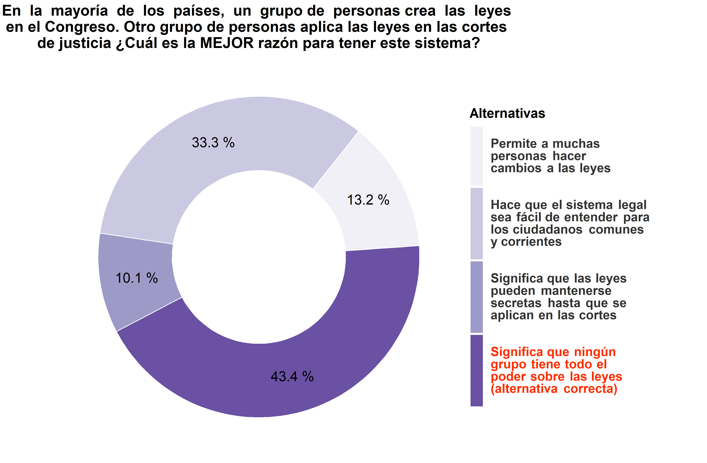
```

#### Segunda pregunta
<div align="justify";>
La mayoría de los estudiantes (un 68.4%) respondió de forma correcta. Las respuestas incorrectas se concentraron en una alternativa en particular, la cual fue seleccionada por el 16.8% de los encuestados.
</div> <br>
```{r echo=FALSE, fig.align='center'}
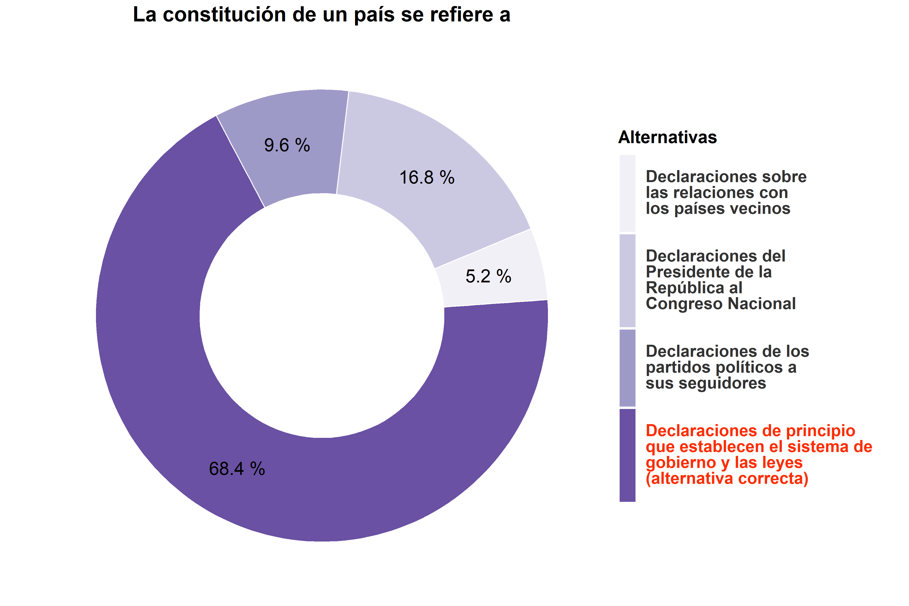
```

#### Tercera pregunta
<div align="justify";>
La mayoría de los estudiantes (un 67.1%) seleccionó la alternativa correcta. Son pocos los estudiantes que se distrajeron con las alternativas incorrectas y la distribución de estas respuestas no se concentró en una alternativa en particular.
</div> <br>
```{r echo=FALSE, fig.align='center'}
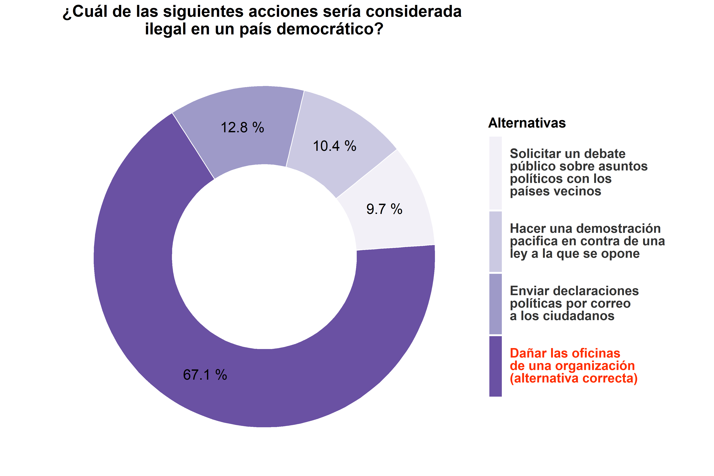
```

#### Cuarta pregunta
<div align="justify";>
La mayoría de los estudiantes (un 59.6%) respondió correctamente. Entre las alternativas incorrectas, hubo una que concentró el 25.7% de las respuestas.
</div> <br>
```{r echo=FALSE, fig.align='center'}
knitr::include_graphics("images/ccivico_4.png")
```

#### Quinta pregunta
<div align="justify";>
Un 49.3% de los estudiantes seleccionó la alternativa correcta. Las respuestas incorrectas se concentraron en una alternativa en particular, la cual fue seleccionada por el 25.7% de los estudiantes.
</div> <br>
```{r echo=FALSE, fig.align='center'}
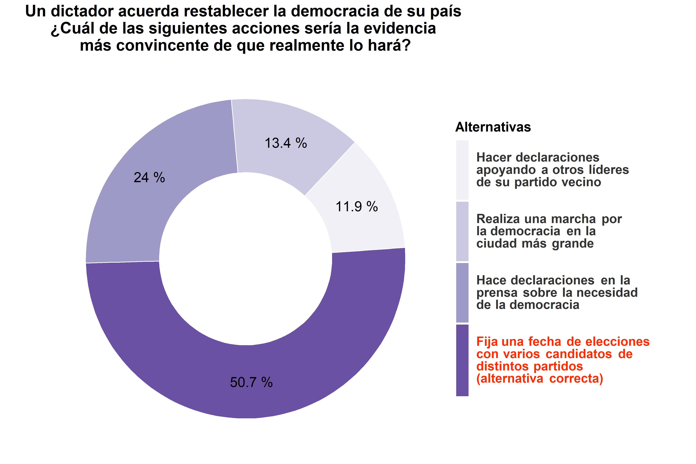
```

#### Sexta pregunta
<div align="justify";>
La mayoría de los estudiantes (un 70.8%) respondió de forma correcta. Si bien son pocos los estudiantes que se distrajeron con las otras alternativas, hubo una alternativa que concentró parte importante de las respuestas incorrectas (un 15.8%).
</div> <br>
```{r echo=FALSE, fig.align='center'}
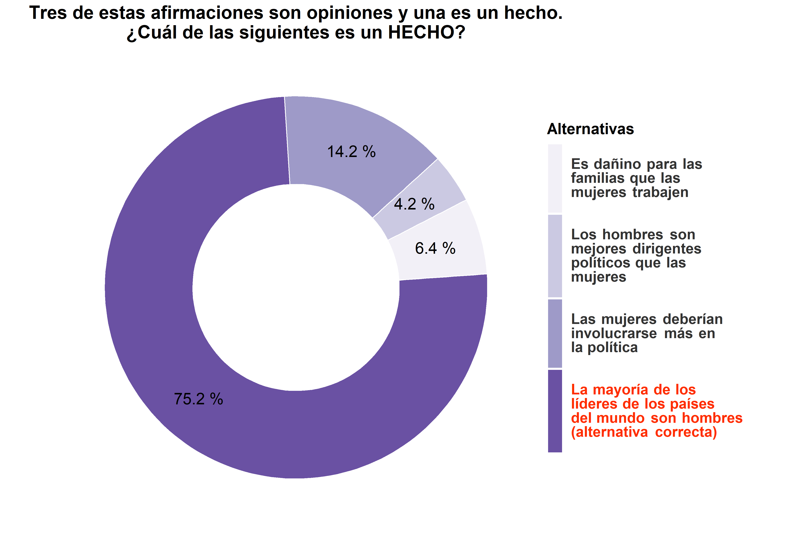
```

#### Séptima pregunta
<div align="justify";>
La mayoría de los estudiantes (un 66.4%) seleccionó la alternativa correcta. En relación con las respuestas incorrectas, una alternativa en particular concentró la mayor parte de las respuestas restantes, siendo seleccionada por el 14.3% de los estudiantes.
</div> <br>
```{r echo=FALSE, fig.align='center'}
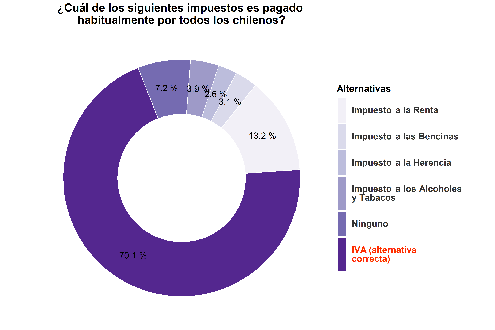
```

#### Octava pregunta
<div align="justify";>
La mayoría de los estudiantes (un 78.4%) respondió correctamente. Fueron pocos los que se distrajeron con las otras alternativas y las respuestas incorrectas no se concentraron en una alternativa en particular.
</div> <br>
```{r echo=FALSE, fig.align='center'}
knitr::include_graphics("images/ccivico_8.png")
```

#### Novena pregunta
<div align="justify";>
Un 44.4% de los estudiantes seleccionó la alternativa correcta. Las respuestas incorrectas no se concentraron en una alternativa en particular. 
</div> <br>
```{r echo=FALSE, fig.align='center'}
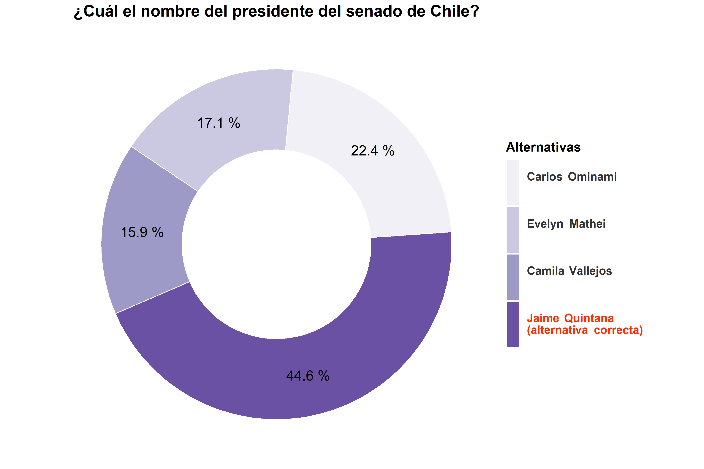
```

#### Décima pregunta
<div align="justify";>
La mayoría de los estudiantes (un 50.5%) respondió de forma correcta. Las respuestas incorrectas se concentraron en una de las alternativas, la cual fue seleccionada por el 33.2% de los estudiantes.
</div> <br>
```{r echo=FALSE, fig.align='center'}
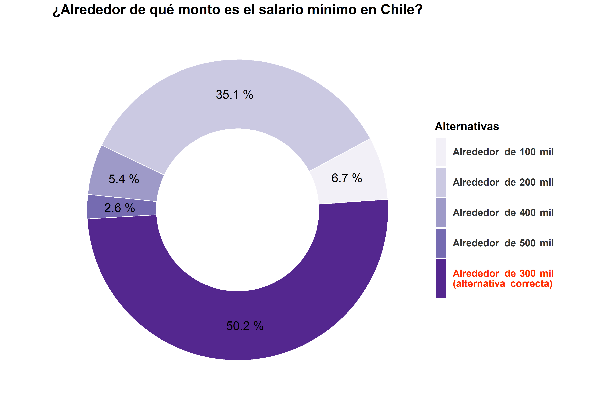
```

#### Undécima pregunta
<div align="justify";>
La mayoría de los estudiantes (un 63.9%) respondió correctamente. Si bien fueron pocos los estudiantes que se distrajeron con las alternativas incorrectas, hubo una alternativa en particular que concentró parte importante de las respuestas restantes (un 17.1%).
</div> <br>
```{r echo=FALSE, fig.align='center'}
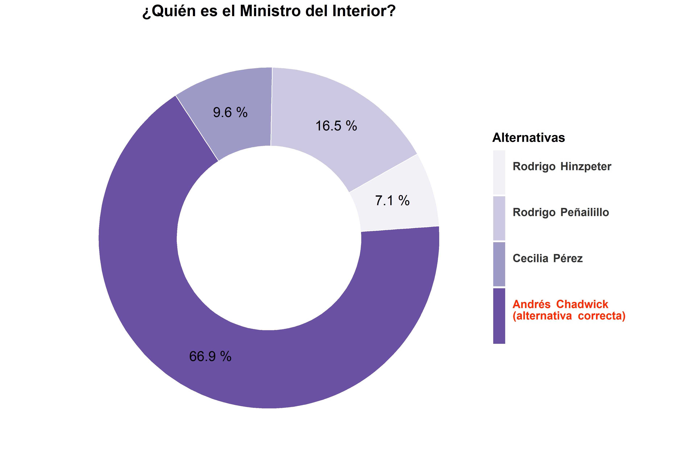
```

#### Duodécima pregunta
<div align="justify";>
La mayoría de los estudiantes (un 69.3%) seleccionó la alternativa correcta. Las respuestas incorrectas se distribuyeron de forma pareja entre las alternativas restantes.  
</div> <br>
```{r echo=FALSE, fig.align='center'}
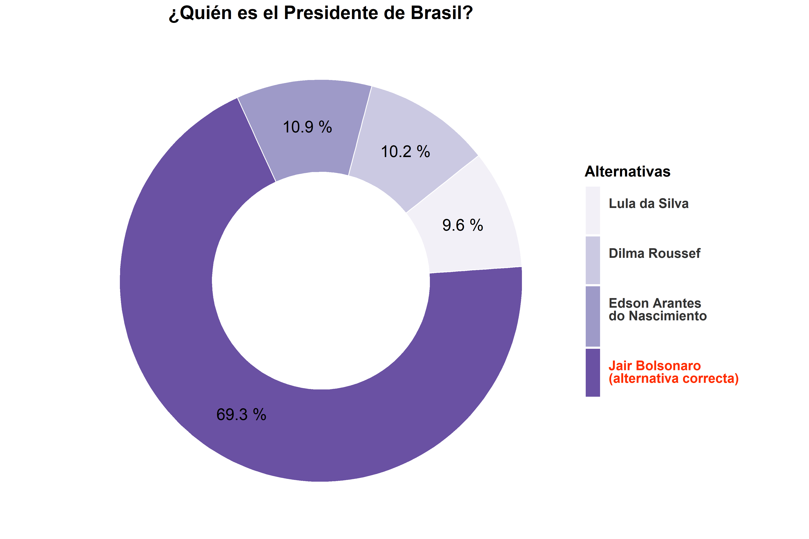
```

#### Decimotercera pregunta
<div align="justify";>
La mayoría de los estudiantes (un 53.2%) respondió de forma correcta. Las respuestas incorrectas se concentraron principalmente en dos alternativas, que fueron seleccionadas por el 21% y el 18.6% de los estudiantes.
</div> <br>
```{r echo=FALSE, fig.align='center'}
knitr::include_graphics("images/ccivico_13.png")
```

#### Decimocuarta pregunta
<div align="justify";>
Un 49% de los estudiantes respondió correctamente. Casi la totalidad de respuestas restantes se concentró en una de las alternativas incorrectas (un 45.8%).
</div> <br>
```{r echo=FALSE, fig.align='center'}
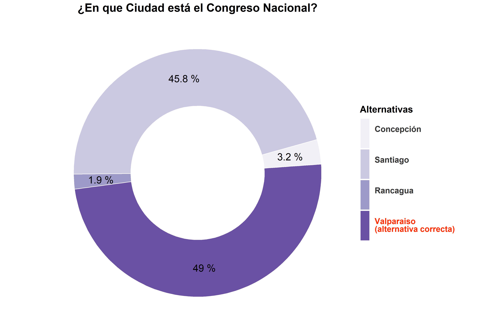
```

### Comparación con el estudio ICCS 2009
<div align="justify";>
Como se enuncio anteriormente, las seis preguntas que se presentarán en esta subsección corresponden a indicadores provenientes del estudio ICCS que evalúan distintas aristas del <strong><i>conocimiento cívico conceptual</i></strong>. Se comparará el patrón de respuesta de los estudiantes de 8°básico, encuestados en el estudio ICCS el año 2009, con las respuestas de los estudiantes de 2°medio, encuestados por este equipo de investigación el año 2019. Cabe destacar que la comparación se realizará con las respuestas de estudiantes de 8°básico debido a que es la única población para la cual existen datos disponibles que permiten evaluar el conocimiento cívico de estudiantes en Chile. <br>
En términos generales, al realizar la comparación se puede concluir que hay una tendencia al alza en la identificación de la respuesta correcta en los estudiantes de segundo medio (en 5 de las 6 preguntas) y que, en la mayoría de las preguntas, la alternativa incorrecta que concentraba más casos en las respuestas de los estudiantes de 8°básico es la misma alternativa incorrecta que concentra más casos en las respuestas de los estudiantes de 2°medio.
</div>

#### Primera pregunta
<div align="justify";>
La mayoría de los estudiantes de ambos cursos no respondió de forma correcta la pregunta. La proporción de estudiantes de 2°medio que seleccionó la alternativa correcta es mayor que la proporción de estudiantes de 8°básico que respondió correctamente (42% y 37.7%, respectivamente). Hubo una alternativa incorrecta en particular que fue un distractor importante para los estudiantes de ambos grupos, concentrando el 38.5% de las respuestas de los estudiantes de 8°básico y el 34% de las respuestas de los estudiantes de 2°medio.
</div> <br>
```{r echo=FALSE, fig.align='center'}
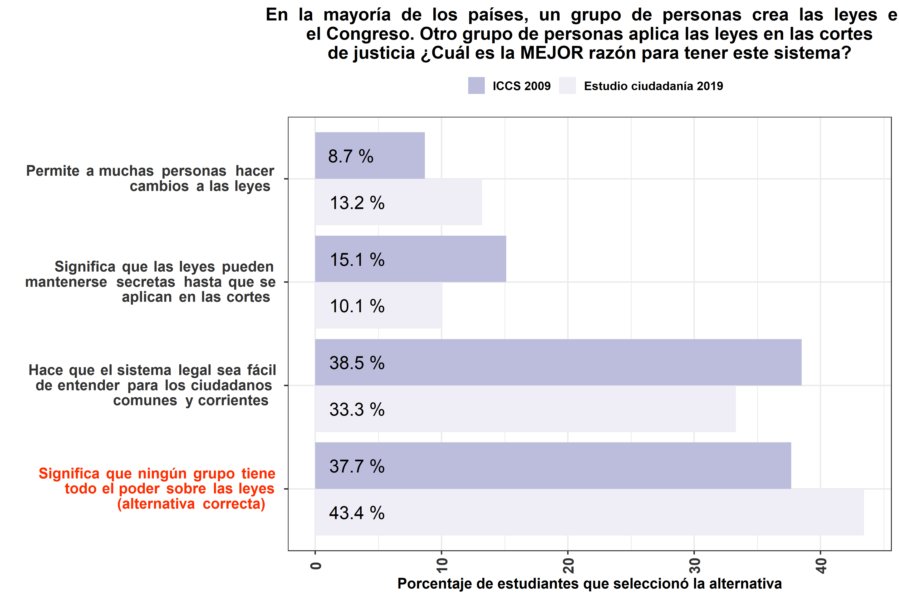
```

#### Segunda pregunta
<div align="justify";>
La mayoría de los estudiantes, tanto de 8°básico como de 2°medio, respondió de forma correcta. Sin embargo, la proporción de estudiantes de 2°medio que seleccionó la alternativa correcta es mayor que la proporción de estudiantes de 8°básico que respondió de forma correcta (68.4% y 58%, respectivamente). Las respuestas incorrectas de ambos grupos de estudiantes se concentraron en una alternativa en particular. Más específicamente, una de las alternativas incorrectas concentró un 24.5% de las respuestas de los estudiantes de 8°básico y un 16.8% de las respuestas de los estudiantes de 2°medio.
</div> <br>
```{r echo=FALSE, fig.align='center'}
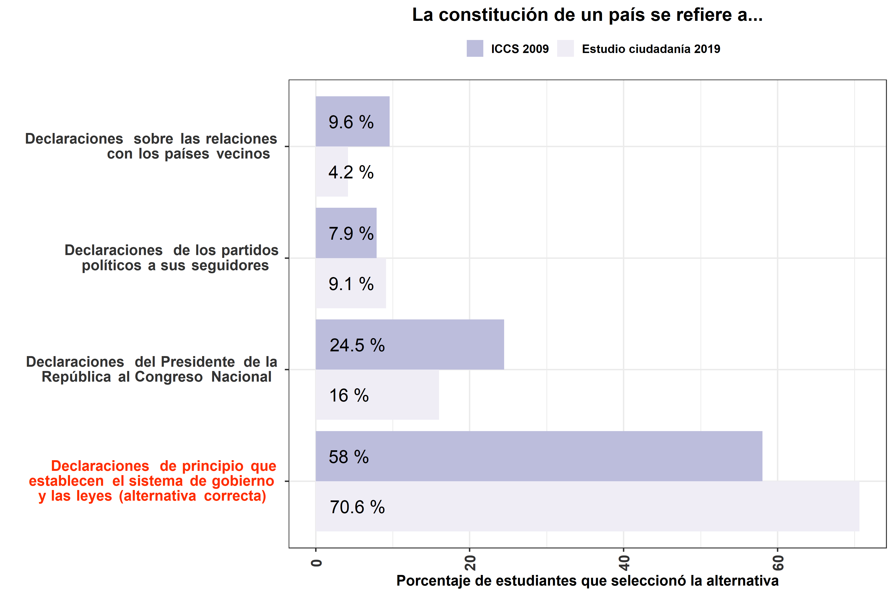
```

#### Tercera pregunta
<div align="justify";>
La mayoría de los estudiantes de ambos grupos respondió de forma correcta, pero la proporción de estudiantes que respondió correctamente es mayor en el grupo de 2°medio que en el de 8°básico (67.1% y 54%, respectivamente). En relación con las respuestas incorrectas, cabe destacar que las respuestas de los estudiantes de 2°medio se distribuyeron de forma relativamente pareja entre las distintas alternativas, mientras que las respuestas de los estudiantes de 8°básico se concentraron en una alternativa en particular, la cual fue seleccionada por el 19.1% de los estudiantes.
</div> <br>
```{r echo=FALSE, fig.align='center'}
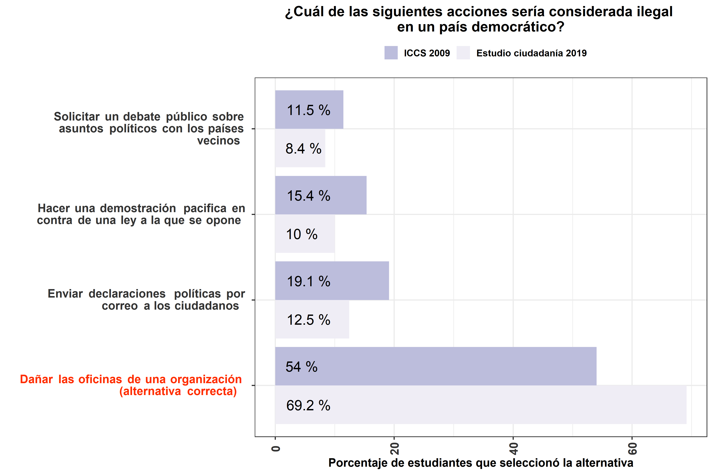
```

#### Cuarta pregunta
<div align="justify";>
La mayoría de los estudiantes de 2°medio (un 59.6%) respondió de forma correcta, mientras que la mayoría de los estudiantes de 8°básico respondió de forma incorrecta. La alternativa que fue seleccionada por una proporción mayor de estudiantes (en ambos grupos) corresponde a la alternativa correcta. Sin embargo, la proporción de estudiantes de 8°básico que identificó la respuesta correcta es mucho menor a la proporción de estudiantes de 2°medio que respondió correctamente (39.9% y 59.6%, respectivamente). Una de las alternativas incorrectas concentró parte importante de las respuestas restantes, siendo seleccionada por el 38.1% de los estudiantes de 8°básico y por el 25.7% de los estudiantes de 2°medio.
</div> <br>
```{r echo=FALSE, fig.align='center'}
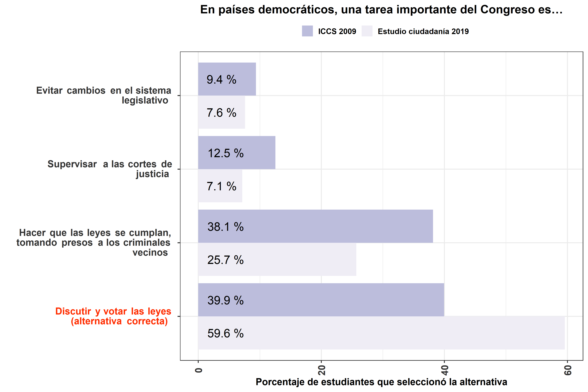
```

#### Quinta pregunta
<div align="justify";>
La mayoría de los estudiantes de ambos grupos respondió de forma incorrecta. Aunque cabe destacar que la alternativa correcta fue la que concentró una mayor proporción de respuestas (un 43.1% de los estudiantes de 8°básico y un 49.3% de los estudiantes de 2°medio seleccionaron la alternativa correcta). Las respuestas incorrectas de ambos grupos de estudiantes se concentraron en una alternativa en particular, la cual fue seleccionada por el 30.8% de los estudiantes de 8°básico y el 22.7% de los estudiantes de 2°medio. 
</div> <br>
```{r echo=FALSE, fig.align='center'}
knitr::include_graphics("images/graph_p5.png")
```

#### Sexta pregunta
<div align="justify";>
La mayoría de los estudiantes seleccionó la alternativa correcta. A diferencia de las respuestas en las otras preguntas, la proporción de estudiantes de 8°básico que identificó la respuesta correcta fue mayor a la proporción de estudiantes de 2°medio que respondió correctamente. Más específicamente, un 77.3% de los estudiantes de 8°básico y un 70.8% de los estudiantes de 2°medio seleccionaron la alternativa correcta. Las respuestas incorrectas de los estudiantes de ambos grupos se concentraron en una alternativa en particular, que fue seleccionada por el 11.8% de los estudiantes de 8°básico y el 15.8% de los estudiantes de 2°medio.</div> <br>
```{r echo=FALSE, fig.align='center'}
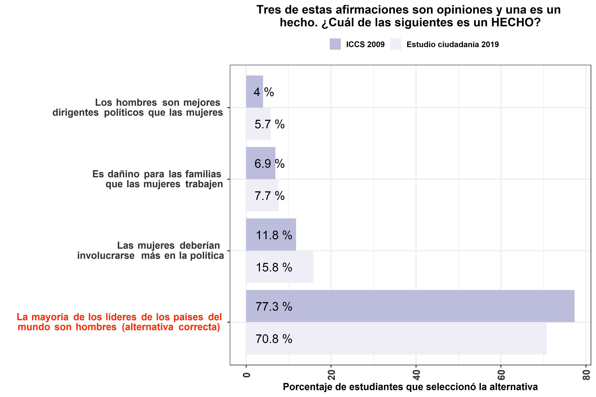
```

## Sección 2: Clima democrático en el aula
<div align="justify";>
En esta sección se presentarán los resultados de una serie de preguntas referidas a la formación ciudadana de los estudiantes. En el análisis de estas preguntas se compararan las respuestas de los docentes, los estudiantes y los apoderados. <br>
</div>
### Importancia de distintos aspectos en la formación ciudadana

<div align="justify";>
La mayoría de los docentes, estudiantes y apoderados cree que <i>el respeto y la amabilidad en las relaciones con los demás</i> son un aspecto muy importante en la formación ciudadana de los estudiantes. Más específicamente, el 96.1% de los docentes, el 57% de los estudiantes y el 85.6% de los apoderados creen que es muy importante. En relación a las alternativas nada importante y algo importante cabe destacar que ninguno de los docentes optó por esas respuestas y que ninguno de los apoderados declaró que es un aspecto nada importante.
</div> 
```{r echo=FALSE, fig.align='center'}
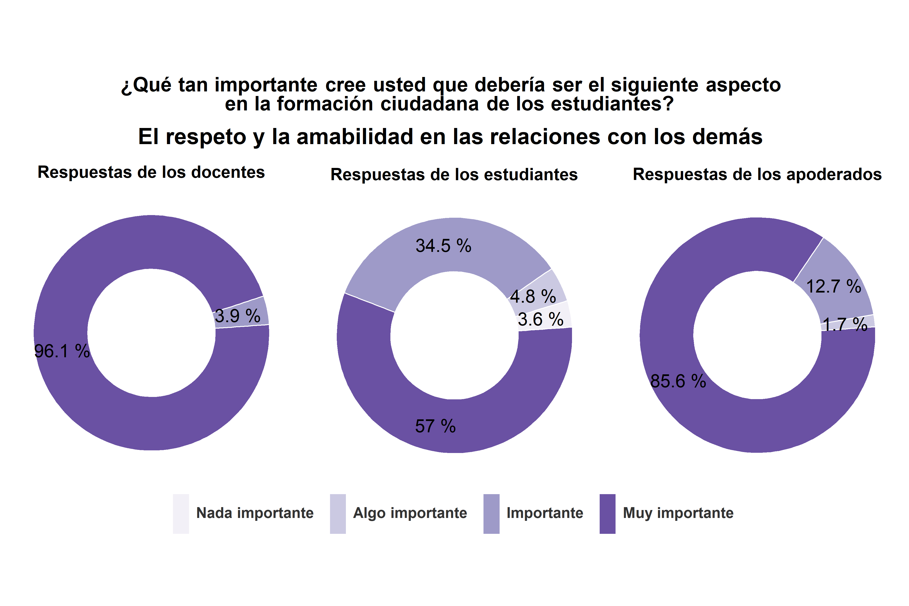
```

<div align="justify";>
La mayoría de los docentes y apoderados considera que <i>los valores democráticos de deliberación, tolerancia y compromiso con el bien común</i> son un aspecto muy importante en la formación ciudadana de los estudiantes. La opinión de los docentes es más homogénea que la de los estudiantes y la de los apoderados, ya que la totalidad de los profesores declaró que es un aspecto importante o muy importante. En cambio, si bien la mayor parte de los estudiantes y apoderados cree que es un aspecto muy importante (el 46.5% y el 71%, respectivamente), en ambos grupos algunas personas declararon que es nada importante o algo importante.
</div>
```{r echo=FALSE, fig.align='center'}
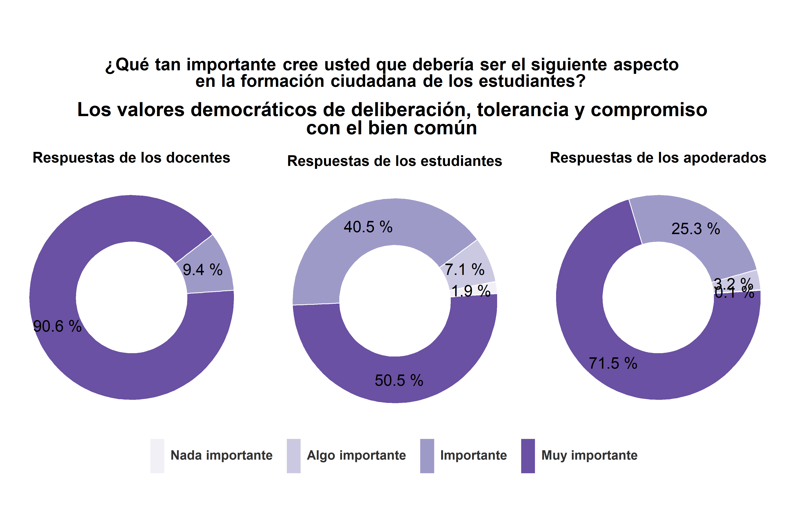
```

<div align="justify";>
La mayoría de los docentes piensa que valorar <i>la participación electoral</i> es un aspecto muy importante en la formación ciudadana de los estudiantes. De hecho, todos los docentes declararon que es un aspecto importante o muy importante. Las opiniones de los estudiantes y apoderados fueron más variadas. Si bien la mayor parte de las respuestas de los estudiantes y de los apoderados se concentraron en las categorías importante (un 45.3% y un 34%, respectivamente) y muy importante, un 21.2% de los estudiantes y un 17.5% de los apoderados señaló que es un aspecto nada importante o algo importante.
</div>
```{r echo=FALSE, fig.align='center'}
knitr::include_graphics("images/graph_for_ciud3.png")
```

<div align="justify";>
La mayoría de los docentes y estudiantes cree que <i>participar de movimientos sociales</i> es un aspecto importante o muy importante en la formación ciudadana de los estudiantes, mientras que la mayoría de los apoderados cree que es un aspecto nada importante o algo importante. Los docentes son quienes más valoran la importancia de este aspecto en la formación ciudadana, el 51% declaro que es importante y el 40.2% que es muy importante. La mayor parte de los estudiantes piensa que es un aspecto importante (un 40.6%) o muy importante (un 22.2%), pero hay un gran grupo de estudiantes que cree que es un aspecto algo importante (29.2%) o nada importante (un 8%). La mayor parte de los apoderados cree que es un aspecto algo importante (un 31.2%) o nada importante (un 29.8%), pero hay un gran grupo de apoderados que piensa que es importante (un 18.4%) o muy importante (un 20.7%).
</div>
```{r echo=FALSE, fig.align='center'}
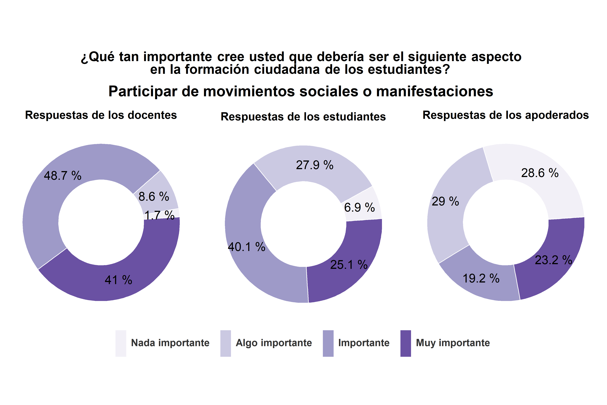
```

<div align="justify";>
La mayoría de los docentes y apoderados piensa que <i>el respeto y cumplimiento de la ley</i> es un aspecto muy importante en la formación ciudadana de los estudiantes (un 64.7% y un 67.2%, respectivamente). La mayor parte de los estudiantes declaro que es un aspecto importante (un 48.1%) o muy importante (un 38%).
</div>
```{r echo=FALSE, fig.align='center'}
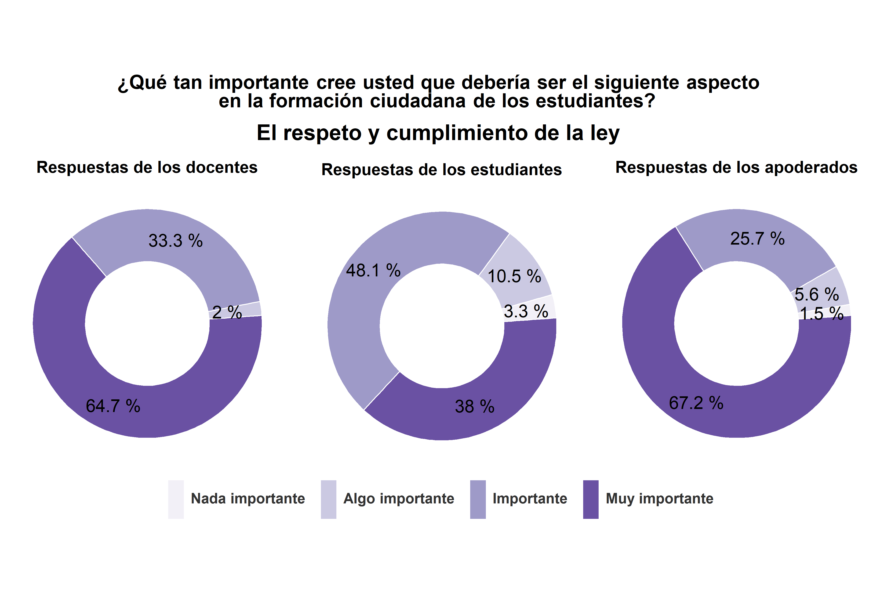
```

<div align="justify";>
Las respuestas de los estudiantes y apoderados son bastante similares. La mayoría de las personas de ambos grupos cree que el aspecto que debería ser más importante en la formación ciudadana es <i>el respeto y la amabilidad en las relaciones con los demás</i> (opción seleccionada por el 60.2% de los estudiantes y el 68.8% de los apoderados). Este aspecto también fue destacado por un gran grupo de docentes (un 33.7%), pero la mayoría de los docentes declaro que el aspecto que debería ser más importante en la formación ciudadana corresponde a <i>los valores democráticos de deliberación, tolerancia y compromiso con el bien común</i> (el 53.7%). 
</div>
```{r echo=FALSE, fig.align='center'}
knitr::include_graphics("images/graph_for_ciud6.png")
```

### Quién juega el rol más importante en distintos aspectos de la formación ciudadana
<div align="justify";>
La mayoría de los estudiantes y de los apoderados cree que la familia es quien juega de hecho el rol más importante en la enseñanza del <i>respeto y la amabilidad en las relaciones con los demás</i> (el 78.2% y el 92.1%, respectivamente). Mientras que la mayoría de los docentes piensa que son los profesores quienes juegan de hecho el rol más importante en la enseñanza de este aspecto de la formación ciudadana (el 51.5%). No obstante, hay una gran proporción de docentes que opina que es la familia quien juega el rol más importante en este aspecto (el 41.6%).
</div>
```{r echo=FALSE, fig.align='center'}
knitr::include_graphics("images/graph_for_ciud7.png")
```

<div align="justify";>
La mayoría de los estudiantes y de los apoderados piensa que es la familia quien juega de hecho el rol más importante en la enseñanza de <i>los valores democráticos de deliberación, tolerancia y compromiso con el bien común</i> (el 51.4% y el 69.9%, respectivamente). Mientras que la mayoría de los docentes cree que son los profesores quienes juegan de hecho el rol más importante en la enseñanza de este aspecto de la formación ciudadana (el 88.1%). Igualmente, cabe destacar que una gran proporción de estudiantes opina que son los profesores quienes juegan de hecho el rol más importante en este aspecto (el 41.3%).
</div>
```{r echo=FALSE, fig.align='center'}
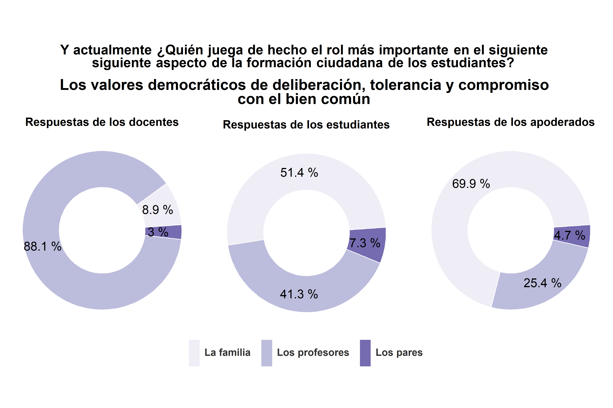
```

<div align="justify";>
La mayoría de los docentes opina que son los profesores quienes juegan de hecho el rol más importante en la enseñanza de <i>valorar la participación electoral</i> (el 88%). Mientras que la mayoría de los apoderados piensa que es la familia quien juega de hecho el rol más importante en la enseñanza de este aspecto de la formación ciudadana (el 65.8%). La opinión de los estudiantes es más heterogénea. El 46.9% de los estudiantes cree que es la familia quien juega el rol más importante en la enseñanza de este aspecto y el 44.9% de los estudiantes cree que son los profesores.
</div>
```{r echo=FALSE, fig.align='center'}
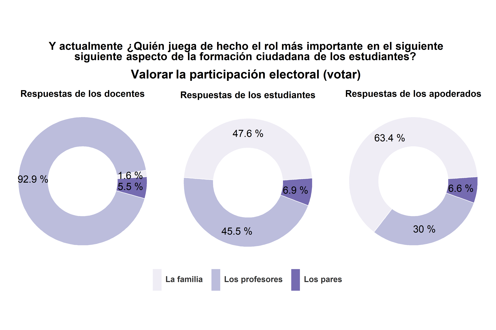
```

<div align="justify";>
En ninguno de los tres grupos más de un 50% de las respuestas se concentra en una alternativa en particular. El 45% de los docentes cree que son los pares quienes juegan de hecho el rol más importante en la enseñanza de <i>participar en movimientos sociales</i> y el 39% de los docentes cree que son los profesores. La opinión de los estudiantes está distribuida de forma equitativa entre las tres alternativas. Un 33.4% de los estudiantes piensa que la familia es quien juega el rol más importante en este aspecto, el 33.4% piensa que son los pares y el 33.2% piensa que son los profesores. En relación a las respuestas de los apoderados, un 49.8% opina que es la familia quien juega de hecho el rol más importante en la enseñanza de este aspecto, un 23.6% opina que son los profesores y un 26.7% opina que son los pares.
</div>
```{r echo=FALSE, fig.align='center'}
knitr::include_graphics("images/graph_for_ciud10.png")
```

<div align="justify";>
La mayoría de los estudiantes y de los apoderados piensa que es la familia quien juega de hecho el rol más importante en la enseñanza del <i>respeto y cumplimiento de la ley</i> (el 62.2% y el 78.2%, respectivamente). Mientras que la mayoría de los docentes cree que son los profesores quienes juegan de hecho el rol más importante en la enseñanza de este aspecto de la formación ciudadana (el 67%).
</div>
```{r echo=FALSE, fig.align='center'}
knitr::include_graphics("images/graph_for_ciud11.png")
```

