# Actitudes políticas
<div align="justify";>
En este módulo se presentan las respuestas de los docentes, estudiantes y apoderados a una serie de preguntas sobre temas políticos y sociales. El análisis se realizará comparando las respuestas de los grupos. Cabe precisar que algunas de las preguntas fueron realizadas solo a los estudiantes y apoderados.
<br>
El reporte de los resultados correspondientes a este módulo se organiza en tres secciones. En la primera sección se presentarán las respuestas a preguntas relativas al interés en la política y al interés en tres distintos problemas sociales. En la segunda sección se expondrán las respuestas a preguntas respecto a la satisfacción con la democracia y distintas actitudes autoritarias. En la tercera sección se mostrarán los resultados de una pregunta sobre la confianza en distintas instituciones, la cual fue presentada solo a los estudiantes. 
</div>
## Sección 1: Interés en política y problemas sociales
<div align="justify";>
La mayoría de los docentes está algo interesado(a) o muy interesado(a) en <i>la política</i> (un 43.1% y un 41.2%, respectivamente). Mientras que la mayoría de los estudiantes y apoderados declara estar no muy interesado(a) (un 33.8% y un 31.6%, respectivamente) o totalmente desinteresado(a) (un 28.8% y un 29.5%, respectivamente).
</div>
```{r echo=FALSE, fig.align='center'}
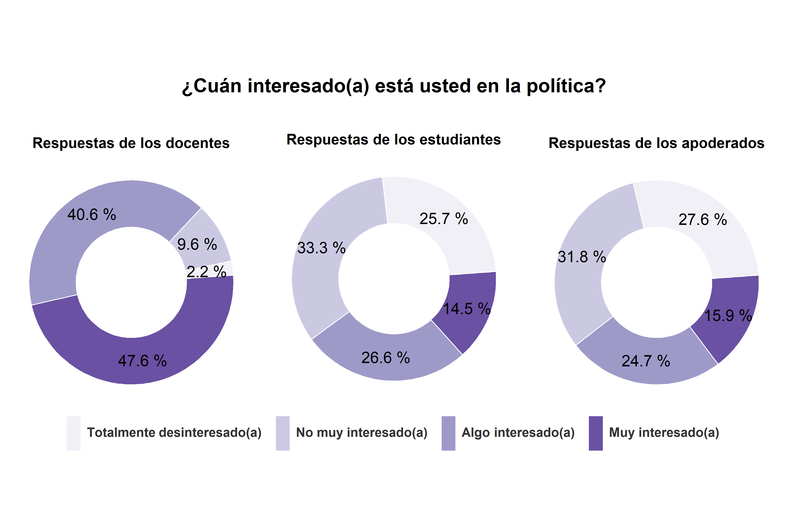
```

<div align="justify";>
La mayoría de los estudiantes y apoderados señala estar algo interesado(a) (un 37.4% y un 40.6%, respectivamente) o muy interesado(a) en <i>la desigualdad social</i> (un 27.5% y un 37%, respectivamente). 
</div>
```{r echo=FALSE, fig.align='center'}
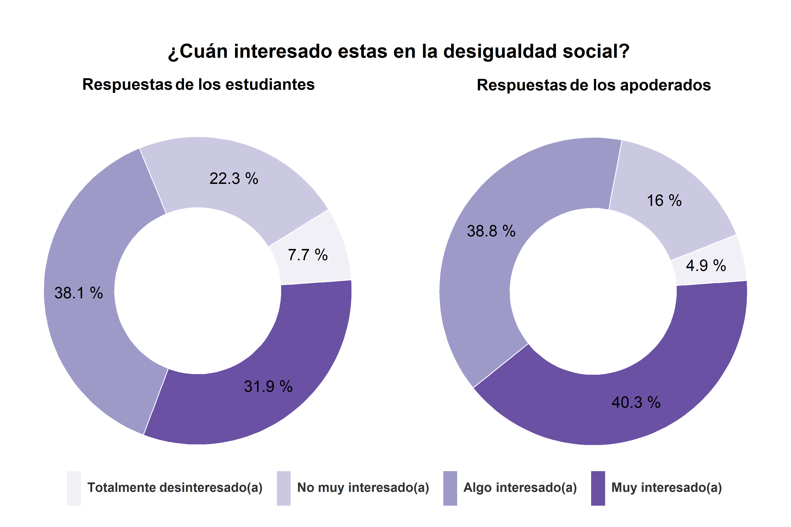
```

<div align="justify";>
El 46.7% de los estudiantes y el 54.9% de los apoderados declara estar muy interesado(a) en <i>el medioambiente</i>. La mayor parte de las respuestas restantes se concentran en la opción algo interesado(a), seleccionada por el 35.5% de los estudiantes y el 34.8% de los apoderados.
</div>
```{r echo=FALSE, fig.align='center'}
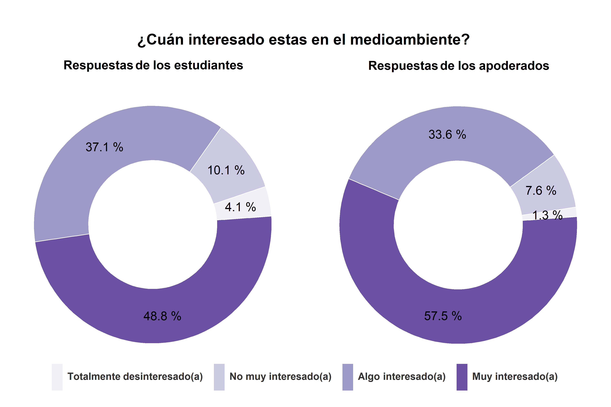
```

<div align="justify";>
La mayoría de los estudiantes y apoderados está algo interesado(a) (un 32.7% y un 37.5%, respectivamente) o muy interesado(a) en <i>la igualdad de género</i> (un 41.4% y un 35.7%, respectivamente). 
</div>
```{r echo=FALSE, fig.align='center'}
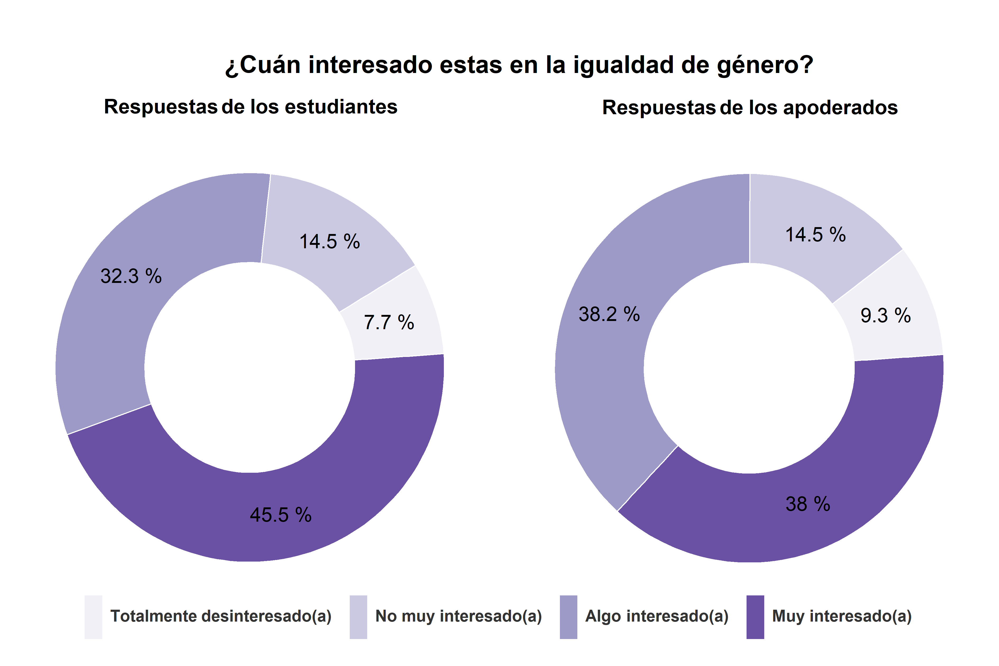
```

## Sección 2: Satisfacción con la democracia y actitudes autoritarias
<div align="justify";>
La mayoría de los estudiantes y apoderados se encuentra nada satisfecho(a) (un 28.2% y un 39.9%, respectivamente) o algo satisfecho(a) con <i>la manera en que funciona la democracia en Chile</i> (un 47.8% y un 44.4%, respectivamente). 
</div>
```{r echo=FALSE, fig.align='center'}
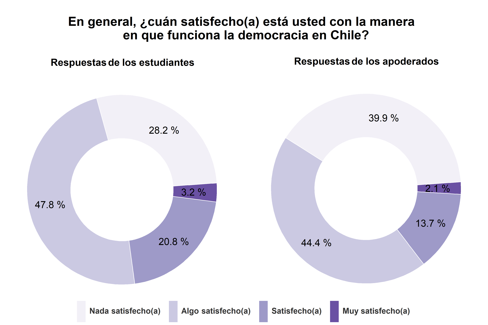
```

<div align="justify";>
La mayoría de los apoderados está muy de acuerdo con que <i>los jóvenes deben aprender a obedecer y respetar a las autoridades</i> (un 76.9%). Mientras que la mayoría de los docentes y de los estudiantes se encuentra de acuerdo con esta afirmación (un 51% y un 55.7%, respectivamente).
</div>
```{r echo=FALSE, fig.align='center'}
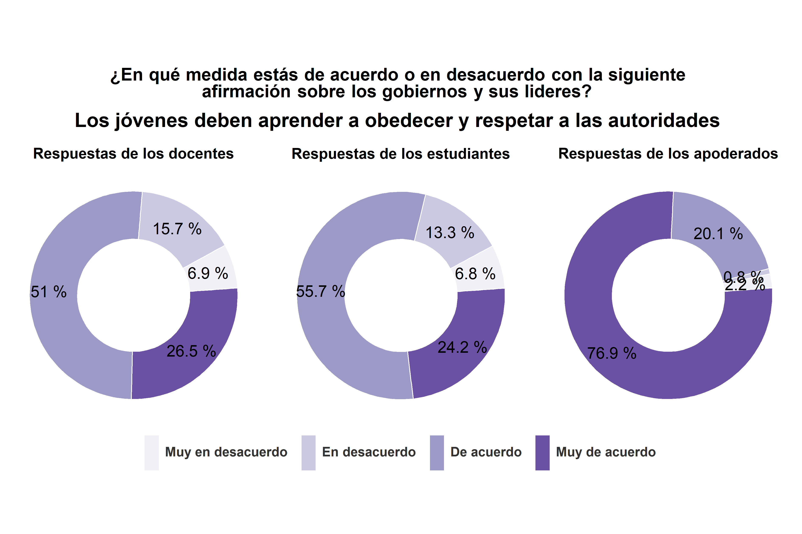
```

<div align="justify";>
La mayoría de los docentes, estudiantes y apoderados se encuentra muy en desacuerdo o en desacuerdo con que <i>mientras más personas estén dispuestas a criticar y desafiar a las autoridades es mejor para la sociedad</i>. Más específicamente, el 9.9% de los docentes, el 13.7% de los estudiantes y el 36.8% de los apoderados se encuentra muy en desacuerdo con esta afirmación, mientras que el 46.5% de los docentes, el 45.1% de los estudiantes y el 31.5% de los apoderados está en desacuerdo.
</div>
```{r echo=FALSE, fig.align='center'}
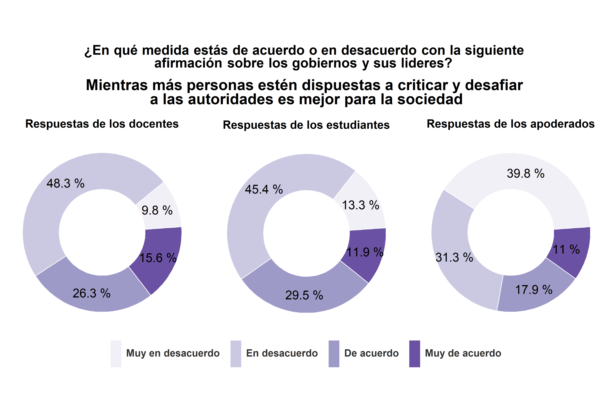
```

<div align="justify";>
La mayoría de los docentes está muy de acuerdo con que <i>la tolerancia con ideas distintas es el valor más importante que los jóvenes debieran aprender</i> (un 81.2) y la mayor parte de los estudiantes se encuentra de acuerdo (un 48%) o muy de acuerdo (41.6%). Mientras que la mayoría de los apoderados está muy en desacuerdo con esta afirmación (un 60.6%).
</div>
```{r echo=FALSE, fig.align='center'}
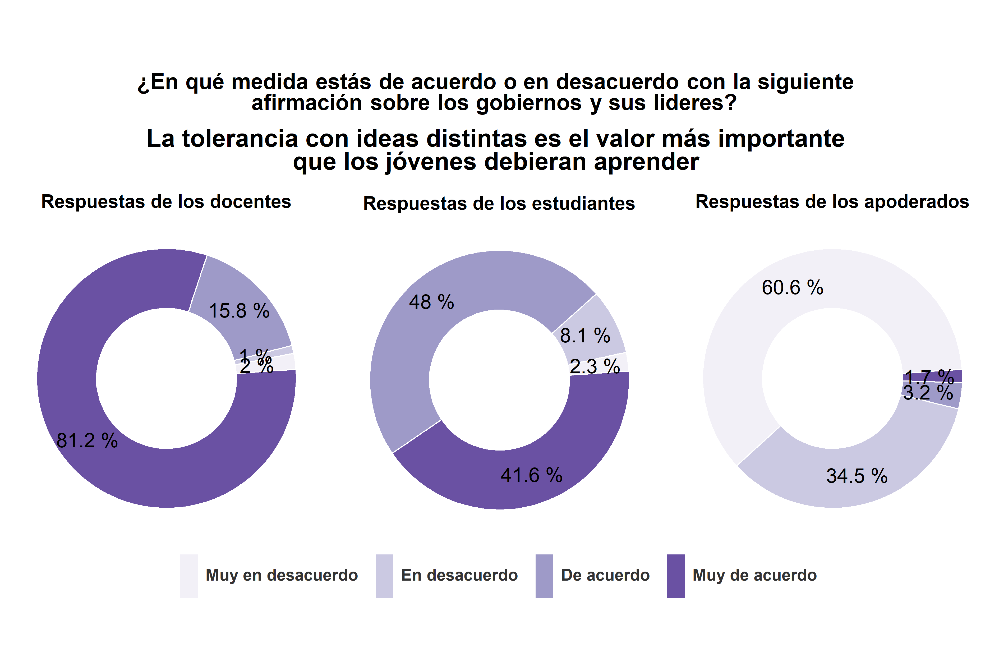
```

<div align="justify";>
La mayoría de los docentes, estudiantes y apoderados está muy en desacuerdo con que <i>a veces es mejor que los gobernantes tomen decisiones sin consultar a las mayorías</i> (un 65.3%, un 50.4% y un 64.7%, respectivamente). La mayor parte de las personas restantes declaro encontrarse en desacuerdo con la afirmación (un 22.8% de los profesores, un 28.9% de los estudiantes y un 28.4% de los apoderados).
</div>
```{r echo=FALSE, fig.align='center'}
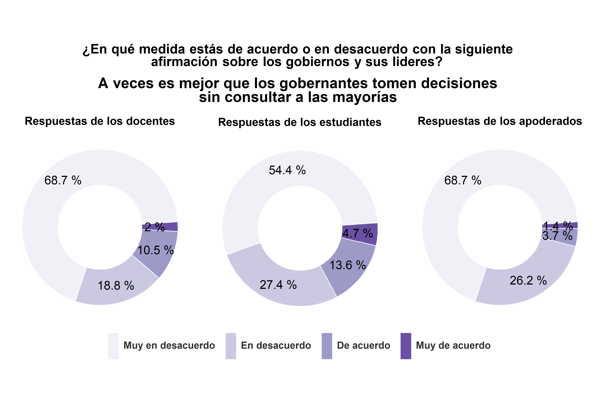
```

<div align="justify";>
La mayoría de los apoderados está muy de acuerdo con que <i>los gobernantes deben hacer valer su autoridad</i> (un 81.9%) y la mayoría de los estudiantes se encuentra de acuerdo con la afirmación (un 53.3%). Las respuestas de los docentes son más heterogéneas. Un 34.6% de los docentes está en desacuerdo con la afirmación  y un 37.6% está de acuerdo con esta.
</div>
```{r echo=FALSE, fig.align='center'}
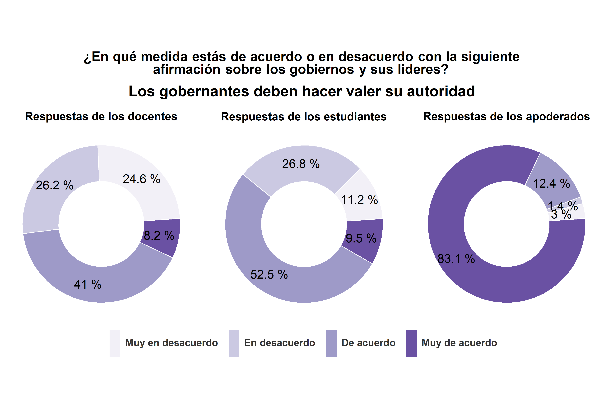
```

<div align="justify";>
La mayoría de los docentes y apoderados está muy en desacuerdo con que <i>los gobernantes pierden autoridad cuando reconocen sus errores</i> (un 69.3% y un 63.5%, respectivamente). La mayor parte de los estudiantes se encuentra muy en desacuerdo (un 29.9%) o en desacuerdo con la afirmación (un 39.4%).
</div>
```{r echo=FALSE, fig.align='center'}
knitr::include_graphics("images/graph_aut6.png")
```

<div align="justify";>
La mayoría de los docentes está muy en desacuerdo con que <i>la concentración del poder ayuda a mantener el orden</i> (un 79.2%) y la mayoría de los apoderados se encuentra muy de acuerdo con esta afirmación (un 80.3%). La opinión de los estudiantes es más diversa. La mayor parte de los estudiantes se encuentra en desacuerdo (un 30.4%) o de acuerdo con la afirmación (un 38.1%).
</div>
```{r echo=FALSE, fig.align='center'}
knitr::include_graphics("images/graph_aut7.png")
```

<div align="justify";>
La mayoría de los docentes y apoderados está muy en desacuerdo con que <i>los gobiernos autoritarios se justifican cuando traen orden y seguridad</i> (un 77.2% y un 60.4%, respectivamente). Mientras que la mayor parte de los estudiantes se encuentra de acuerdo con esta afirmación (un 45.5%).
</div>
```{r echo=FALSE, fig.align='center'}
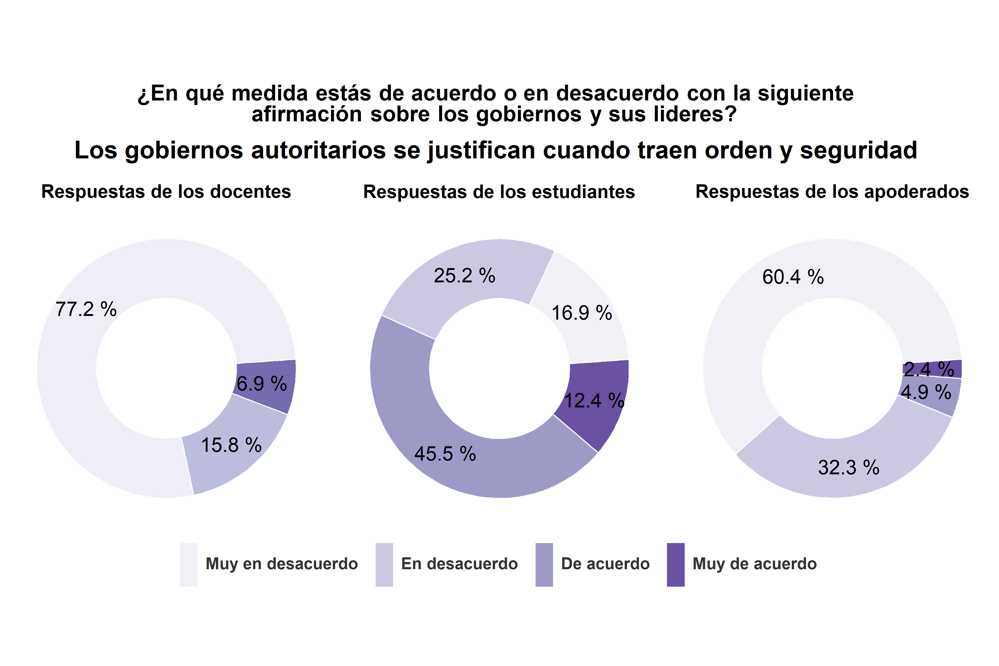
```

<div align="justify";>
La mayoría de los docentes y apoderados está muy en desacuerdo con que <i>los gobiernos autoritarios se justifican cuando traen beneficios económicos</i> (un 74.5% y un 71.6%, respectivamente). Mientras que la mayor parte de los estudiantes se encuentra de acuerdo con la afirmación (un 47%).
</div>
```{r echo=FALSE, fig.align='center'}
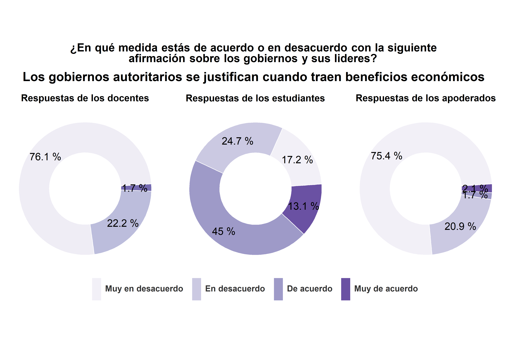
```

## Sección 3: Confianza en instituciones
<div align="justify";>
La mayoría de los estudiantes confía nada o un poco en los grupos e instituciones por los que se consultó. La institución en la que menos confían los estudiantes corresponde a <i>los partidos políticos</i>. El 32.3% de los estudiantes declaro que confía nada en los partidos políticos y el 51.9% que confía un poco en esta institución. El grupo en el que más confían los estudiantes corresponde a <i>las personas en general</i>. El 29.2% de los estudiantes confía bastante en las personas en general y el 5.6% confía completamente en este grupo.
</div>
```{r echo=FALSE, fig.align='center'}
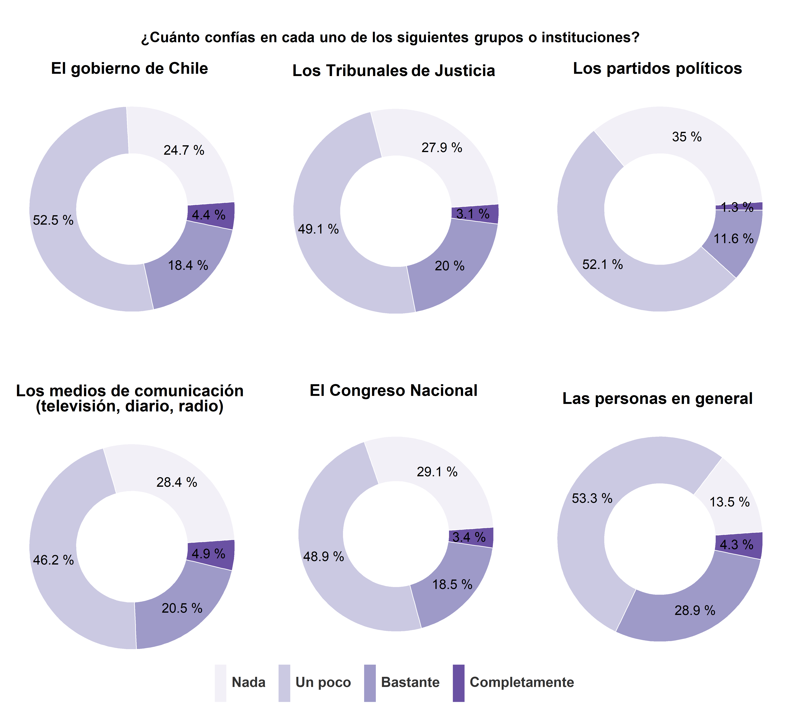
```

