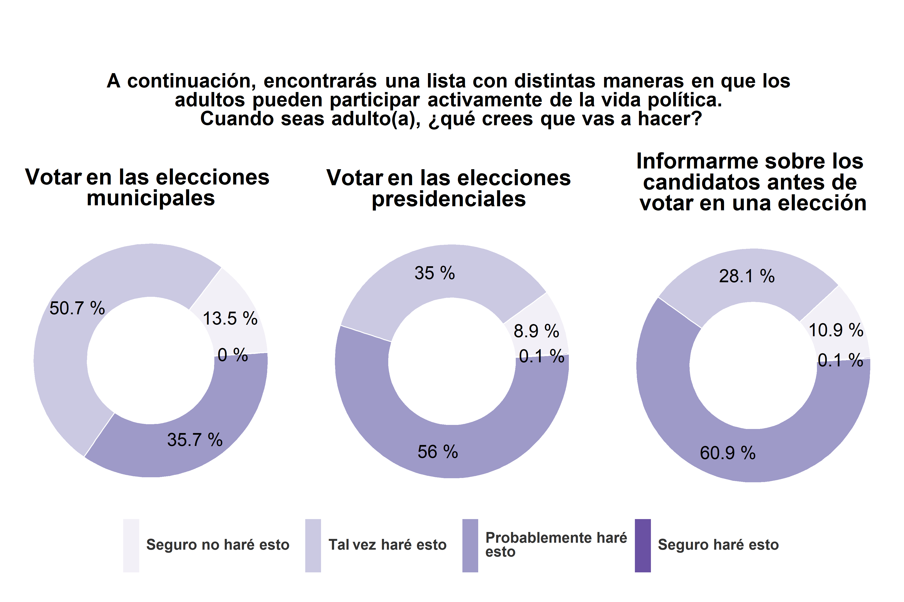
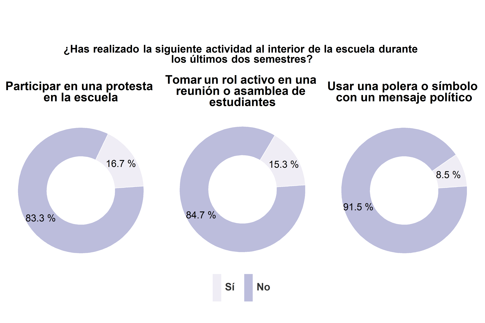
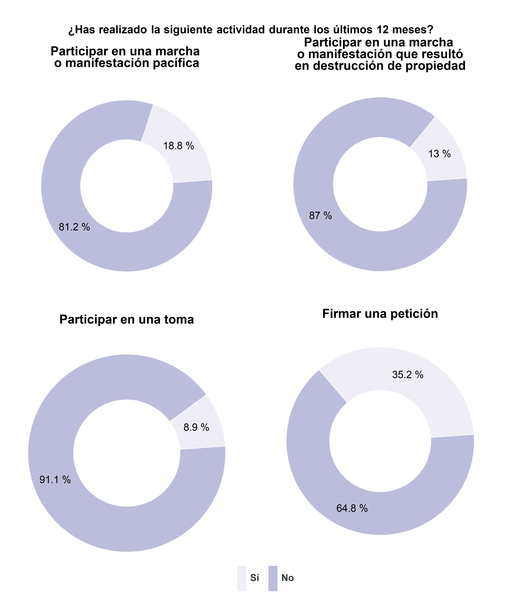
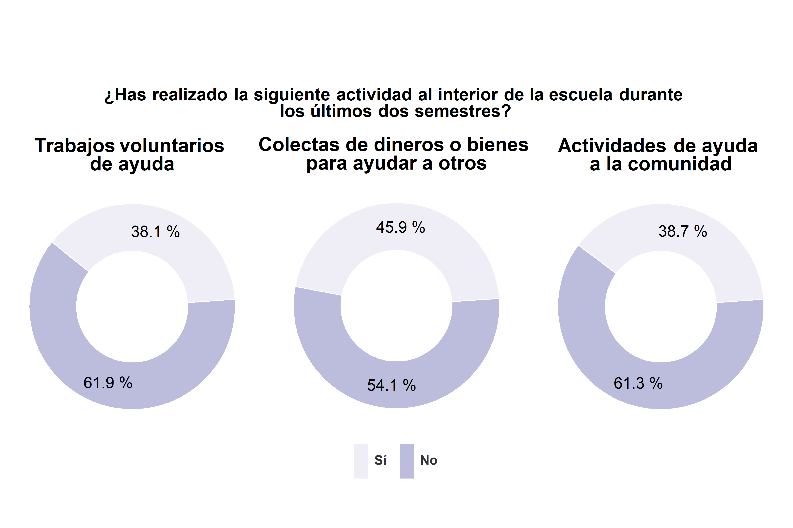
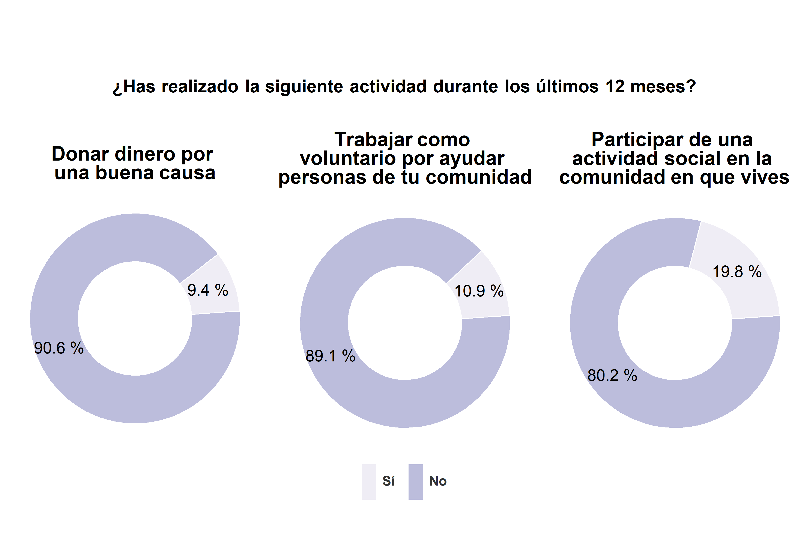

# Participación
<div align="justify";>
En este módulo se presentan las respuestas de los estudiantes a una serie de preguntas sobre su participación en distintas actividades al interior de la escuela y fuera de la escuela. El reporte de los resultados se organiza en tres secciones. En la primera sección se presentarán los resultados de preguntas sobre la participación formal de los estudiantes en actividades al interior de la escuela y sobre la disposición de los estudiantes a participar en instancias políticas formales cuando sea adulto. En la segunda sección se expondrán los resultados a preguntas sobre la participación activista de los estudiantes en actividades al interior de la escuela y fuera de esta. En la tercera sección se mostrarán los resultados de preuntas sobre la participación comunitaria de los estudiantes en actividades al interior de la escuela y fuera de esta. <br>
En términos generales, cabe destacar que la participación de los estudiantes se concentra en actividades realizadas al interior de la escuela. Las actividades que han sido realizadas por una mayor proporción de estudiantes son: votar en una elección, firmar una petición, trabajos voluntarios de ayuda, colectas de dineros o bienes para ayudar a otros y actividades de ayuda a la comunidad.
</div>

## Sección 1: Participación formal
<div align="justify";>
En relación con la participación en votaciones, la mayoría de los estudiantes declara que ha votado en una elección al interior de su escuela durante los últimos dos semestres (un 61.2%). En relación con la postulación a cargos de representación, la mayoría de los estudiantes señala que durante los últimos dos semestres no ha sido candidato para representar a la clase o para ser parte del centro de alumnos (un 75.1%), ni tampoco ha sido efectivamente parte del centro de alumnos (un 86%).
</div>
```{r echo=FALSE, fig.align='center'}
knitr::include_graphics("images/graph_partform_act.png")
```

<div align="justify";>
Al consultar a los estudiantes sobre su disposición a participar activamente de la vida política cuando adulto, solo un 0.1% responde "seguro haré esto" ante las distintas actividades que se les presentan. Respecto a votar en las elecciones municipales, la mayoría de los estudiantes señala que tal vez lo hará (un 52.1%). En relación con las otras dos actividades, la mayoría de los estudiantes declara que probablemente lo hará. Más específicamente, el 51.6% dice que probablemente votará en las elecciones presidenciales y el 57.3% que probablemente se informará sobre los candidatos antes de votar en una elección.
</div>
```{r echo=FALSE, fig.align='center'}

```

## Sección 2: Participación activista
<div align="justify";>
Son pocos los estudiantes que declaran haber realizado actividades de participación activista. La mayoría de los estudiantes declara que no ha participado en una protesta, tomado un rol activo en una reunión o asamblea de estudiantes, ni usado una polera o símbolo con un mensaje político al interior de la escuela durante los últimos dos semestres (un 84%, un 82% y un 91.2%, respectivamente). 
</div>
```{r echo=FALSE, fig.align='center'}

```

<div align="justify";>
Como puede apreciarse la mayoría de los estudiantes no ha firmado una petición, ni ha participado en una marcha o una toma. Entre estas actividades, firmar una petición es aquella en la que más estudiantes ha participado (un 35.2%). Resulta interesante que la diferencia entre quienes participaron en marchas pacificas y quienes participaron en marchas que resultaron en destrucción de propiedad es pequeña (un 18.8% y un 13%, respectivamente).
</div>
```{r echo=FALSE, fig.align='center'}

```

## Sección 3: Participación comunitaria
<div align="justify";>
El ámbito de la participación comunitaria al interior de la escuela es aquel en que una mayor proporción de estudiantes ha realizado actividades (en comparación con la participación formal y activista). Pese a que la mayoría de los estudiantes señala que no ha realizado trabajos voluntarios, colectas de dineros o bienes para ayudar a otros, ni actividades de ayuda a la comunidad al interior de la escuela durante los últimos dos semestres (un 61.9%, un 54.1% y un 61.3%, respectivamente). 
</div>
```{r echo=FALSE, fig.align='center'}

```

<div align="justify";>
Pocos estudiantes han realizado actividades de participación comunitaria fuera de su escuela. La mayoría de los estudiantes no ha donado dinero por una buena causa, trabajado como voluntario para ayudar a personas de su comunidad, ni ha participado de una actividad social en la comunidad en que vive durante los últimos 12 meses (un 91.3%, un 90.5% y un 79%, respectivamente). 
</div>
```{r echo=FALSE, fig.align='center'}

```
